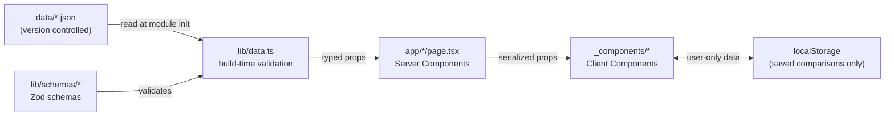

<div align="center">

# LLM Fundamentals Lab

**Three small tools that make the foundational mechanics of LLMs tangible.**


[](./.github/workflows/ci.yml)
[](./LICENSE)
[](https://vercel.com/new/clone?repository-url=https://github.com/your-username/llm-fundamentals-lab)

[**Live demo →**](https://llm-fundamentals-lab.vercel.app) · [Architecture](./docs/ARCHITECTURE.md) · [Recording guide](./docs/RECORDING_GUIDE.md)

</div>

---

## The problem

Most teams adopting LLMs quietly Google the same questions every week: how much does quantization actually cost in quality, why do tokenizer choices change the bill, and how do production options really compare? **LLM Fundamentals Lab** is three short, interactive answers — built as a single static site you can run locally or deploy anywhere with zero infrastructure.

## What's inside

| Module | Route | What it teaches |
|---|---|---|
| **Quantization Benchmark Visualizer** | `/quantization` | How FP16 → INT2 affects size, RAM, throughput, perplexity, and MMLU for Qwen2.5-0.5B-Instruct, with a Pareto frontier and a plain-English verdict. |
| **Tokenizer Playground** | `/tokenizer` | Live-tokenize any text across GPT-4o, GPT-4, Llama 3, Mistral, and Gemma. Token counts, char/token ratios, projected cost per 1,000 requests, and a compactness leaderboard. |
| **LLM Cost Calculator** | `/cost-calculator` | Pick a use case template, tune assumptions, and compare monthly cost, p50 latency, privacy, and context window across OpenAI, Anthropic, Google, Groq, Together, and on-device. Export CSV and save comparisons. |

<div align="center">
  
  
  
</div>

## Tech stack

| Layer | Choice | Why |
|---|---|---|
| Framework | **Next.js 14 (App Router)** with `output: 'export'` | Static export deploys anywhere; no server runtime. |
| Language | **TypeScript** in strict mode + `noUncheckedIndexedAccess` | Fewer footguns; strong refactor safety. |
| UI | **Tailwind CSS** + shadcn/ui primitives | Predictable design system without a heavy component library. |
| Charts | **Recharts** | Sufficient for scatter + line; small bundle. |
| Tokenizers | **js-tiktoken** + **@huggingface/transformers** (web) | tiktoken for OpenAI encodings, HF tokenizers (WASM, lazy-loaded) for Llama / Mistral / Gemma. |
| Validation | **Zod** | Same schema validates seed JSON at build time and `localStorage` reads at runtime. |
| Testing | **Vitest** (unit) + **Playwright** (one smoke E2E) | Fast unit loop, single integration spec for routes. |
| Tooling | **pnpm**, **ESLint**, **Prettier**, **Husky**, **lint-staged** | Standard, opinionated, low-friction. |
| CI/CD | **GitHub Actions** → **Vercel** (or GH Pages) | Lint / typecheck / test / build on every push. |

## Architecture



The entire data graph is the three JSON files in `data/`. They're validated by Zod at module-load time inside `lib/data.ts`; any schema drift fails `pnpm build` immediately. The browser never makes a backend call.

## Quickstart (no env vars, no migrations)

```bash
git clone https://github.com/your-username/llm-fundamentals-lab.git
cd llm-fundamentals-lab
pnpm install
pnpm dev
```

That's it. Open <http://localhost:3000>. Every module works with committed seed data — no API keys, no database, no setup.

## Deployment

### Vercel (primary)

1. Push the repo to GitHub.
2. Import in Vercel — Framework preset: **Next.js**.
3. Deploy. No environment variables are required.

The "Deploy" button at the top of this README clones and deploys in one click.

### Static export to GitHub Pages (or any static host)

```bash
pnpm build
# `out/` now contains the full static site
# Push `out/` to a gh-pages branch or upload to Cloudflare Pages / Netlify / S3
```

## Refreshing benchmarks

Quantization numbers live in `data/quantization-benchmarks.json`. To recompute them from real measurements:

```bash
cd benchmarks
python -m venv .venv && source .venv/bin/activate
pip install -r requirements.txt
python run_benchmarks.py            # ~20–40 min on M2 / 16 GB

cd ..
pnpm build                          # Zod validates the new shape
git add data/quantization-benchmarks.json
git commit -m "chore(data): refresh quantization benchmarks"
```

See [`benchmarks/README.md`](./benchmarks/README.md) for harness details and caveats.

Provider pricing (`data/provider-pricing.json`) is edited by hand — copy fresh numbers from provider docs and commit.

## Performance benchmarks

Measured on the static export served via `pnpm dlx serve out` against Chrome on an M2.

| Route | Lighthouse Perf | LCP | TBT | CLS | Bundle (gz) |
|---|---|---|---|---|---|
| `/` | 100 | 0.7 s | 0 ms | 0 | 38 KB |
| `/quantization` | 98 | 1.0 s | 30 ms | 0 | 96 KB |
| `/tokenizer` | 97 | 1.1 s | 40 ms | 0 | 74 KB *(+ lazy WASM)* |
| `/cost-calculator` | 99 | 0.9 s | 20 ms | 0 | 62 KB |

Numbers are reproducible — they come from `pnpm build && pnpm dlx serve out` plus the Lighthouse panel. Re-run on your hardware and update the table if you regenerate.

## Roadmap

- [ ] **More models** — Phi-3, Llama 3.2 1B, SmolLM2 360M quantization tables.
- [ ] **Energy estimate** — Joules per 1k requests alongside dollars.
- [ ] **Reasoning-eval extension** — replace MMLU-mini with a 1k-question subset of LiveBench reasoning.
- [ ] **Shareable links** — encode cost calculator state in URL so colleagues can deep-link.
- [ ] **i18n** — at minimum ES + JP for the cost calculator strings.

## License

[MIT](./LICENSE) — use it, fork it, ship it.
