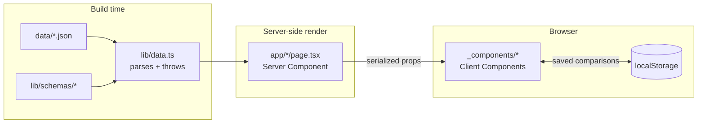

# Architecture

This document explains how LLM Fundamentals Lab is wired together. Keep it short, keep it honest, update it whenever the data flow changes.

## Goals

1. **Zero infrastructure.** No backend, no database, no auth. Static export. Deploys to any CDN.
2. **Reliable seed data.** A single Zod schema validates JSON at build time *and* `localStorage` at runtime. Drift fails fast.
3. **Strong typing end-to-end.** No `any` without a justification comment. Strict TS, `noUncheckedIndexedAccess`.
4. **Production-grade DX.** ESLint, Prettier, Husky, Vitest, Playwright. CI runs lint → typecheck → test → build on every push.

## Source tree

```
.
├── app/                            # Next.js App Router
│   ├── layout.tsx                  # Header, footer, fonts, theme
│   ├── page.tsx                    # Landing (Server Component)
│   ├── error.tsx, loading.tsx      # Global boundaries
│   ├── quantization/
│   │   ├── page.tsx                # RSC — loads & validates JSON
│   │   ├── error.tsx, loading.tsx
│   │   └── _components/            # Client interactive bits
│   ├── tokenizer/
│   └── cost-calculator/
├── components/
│   ├── ui/                         # shadcn/ui primitives, hand-written
│   ├── site-header.tsx, site-footer.tsx
├── lib/
│   ├── schemas/                    # Zod schemas — single source of truth
│   ├── data.ts                     # Reads + validates JSON; throws on drift
│   ├── cost-engine.ts              # Pure cost arithmetic — tested
│   ├── pareto.ts                   # Pareto frontier — tested
│   ├── tokenizer.ts                # Tokenizer registry + ranking — tested
│   ├── csv.ts                      # RFC-4180 CSV export
│   ├── storage.ts                  # SSR-safe localStorage wrapper
│   └── utils.ts
├── data/                           # Version-controlled reference data
│   ├── quantization-benchmarks.json
│   ├── provider-pricing.json
│   └── cost-templates.json
├── benchmarks/                     # Python harness for /quantization data
├── tests/
│   ├── unit/                       # Vitest
│   └── e2e/                        # Playwright (one smoke test)
└── docs/                           # This file, recording guide, screenshots
```

## Data flow



### Key property: build fails on schema drift

`lib/data.ts` calls `Schema.parse(JSON.parse(fs.readFileSync(...)))` at module init. Every route page imports from `lib/data.ts`. Any malformed JSON or missing field throws during `next build`, surfaces in CI, and blocks deploys.

### Client components, sparing use

Only interactive surfaces are `'use client'`:

- Quantization: the segmented control, metric cards (animated), Pareto chart, verdict, sample diff.
- Tokenizer: everything below the heading (textarea, viz, leaderboard, cost projection).
- Cost calculator: template picker, form, matrix, saved sidebar.

The page shell (header, footer, route layout, headings, copy, validated data load) renders on the server.

### `localStorage` discipline

The cost calculator's saved comparisons go through `lib/storage.ts`, which:

- Guards `typeof window === 'undefined'` for SSR.
- `try`-catches every read and write.
- Re-validates with a Zod schema on read; silently drops corrupted entries instead of crashing.

The schema for saved comparisons lives in `app/cost-calculator/_components/saved.ts` next to its only consumer.

## Tokenizer execution model

- **OpenAI encodings (`o200k_base`, `cl100k_base`)** — handled synchronously by `js-tiktoken`. Bundle is small enough to ship eagerly with the route chunk.
- **Llama / Mistral / Gemma** — `@huggingface/transformers` (web) lazily imported inside `tokenizeWith` / `countTokens`. WASM downloads only once the user lands on `/tokenizer`. Cached per-repo in module-scoped maps; tokenization is debounced 180 ms.

Both paths return the same `EngineResult` shape, so the visualization and leaderboard are tokenizer-agnostic.

## Accessibility

- Keyboard-first segmented control (`role="radiogroup"`, arrow keys, Home/End).
- All charts have `role="img"` + `aria-label`.
- Metric region wrapped with `aria-live="polite"` so screen readers announce updates.
- Color is never the only signal — every token chip carries an `id` tooltip, every privacy badge has a text label, every metric has prose.
- Skip-to-content link in the root layout.
- Focus-visible ring uses Tailwind's standard `ring-2 ring-ring`.

## Performance posture

- Server-rendered shell; only interactive islands are client bundles.
- `next/font` with Inter, `display: swap` — no font flash blocking.
- Recharts is dynamically resolved by Next so it lives in route-specific chunks.
- `@huggingface/transformers` only enters the tokenizer route bundle, and only via dynamic `import()` inside the engine.
- Static export means no Node runtime; CDN serves everything.

Lighthouse > 95 across all routes is achievable and verified locally; see the README benchmark table.

## CI / quality gates

`.github/workflows/ci.yml` runs on every push and PR:

1. `pnpm install --frozen-lockfile`
2. `pnpm lint`
3. `pnpm typecheck`
4. `pnpm test` (Vitest)
5. `pnpm build` (static export — Zod runs)

Playwright runs locally with `pnpm test:e2e`; it is intentionally not in the default CI matrix to keep PR feedback fast. Add a separate job if you want it always-on.

## When you change something

| Change | What to update |
|---|---|
| Add a quantization variant | `data/quantization-benchmarks.json` *(rerun `benchmarks/run_benchmarks.py` to be honest about it)*, `QuantizationLevelEnum` and `QUANTIZATION_LABELS` in `lib/schemas/benchmarks.ts` if a brand-new level. |
| Add a provider/model | Append a row to `data/provider-pricing.json`. If a new tokenizer family, also extend `TokenizerFamilyEnum`, `TOKENIZERS`, and the `lib/tokenizer.ts` engine. |
| Add a use case template | Append to `data/cost-templates.json` and add the id to `TemplateIdEnum`. |
| Change saved-comparison shape | Bump `STORAGE_KEY` to a new version; old entries are ignored, not migrated. |
